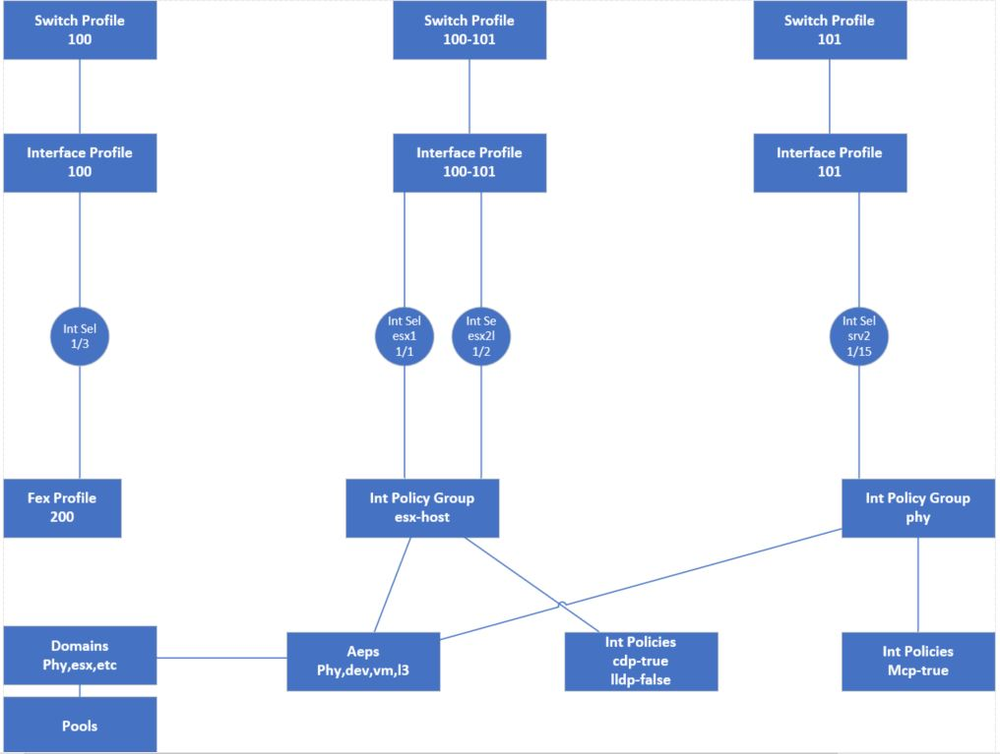
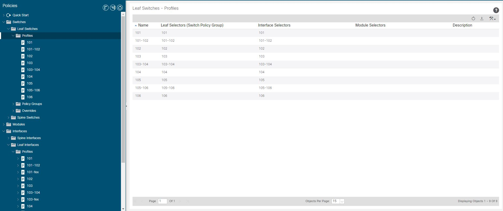

## Examples
The framework deploys one of the most common, but not  only, types of access topologies.  It will create a switch profile and interface profile of the same name for both single switches and vpc pairs.  It assumes an odd-even sequential relationship for vpc pairs

#### Below depicts deployment with a leaf range of 101-106 with FEXs on 101 and 103

#### once deployed you can add a new server by going to the Interface Profile and creating an new Interface Selector

